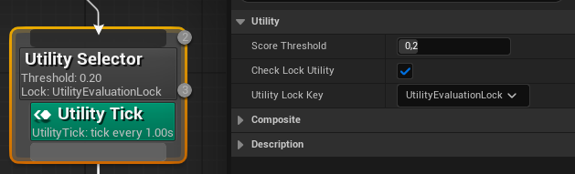
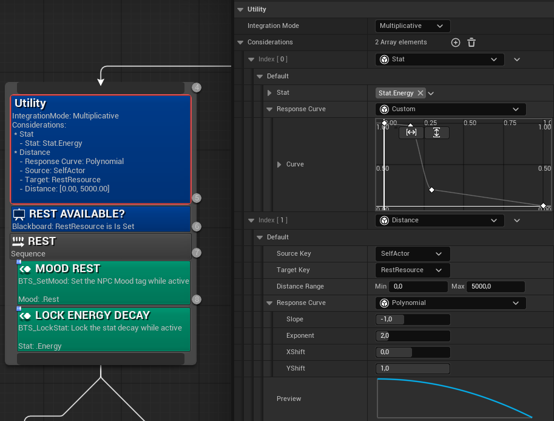
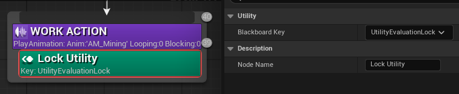
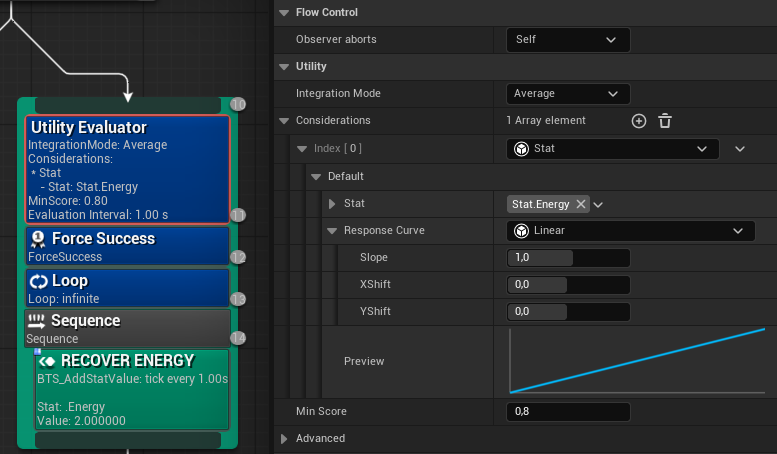
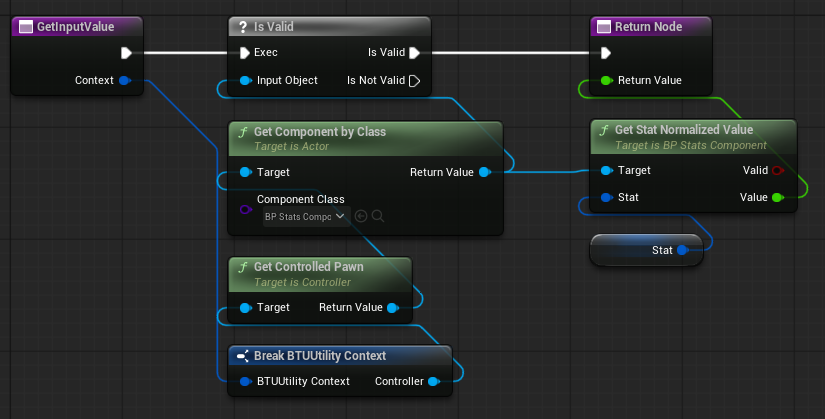
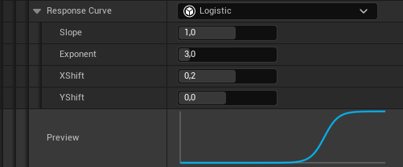
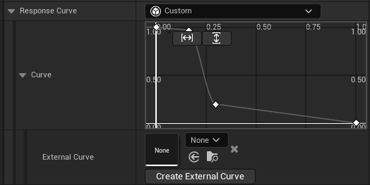
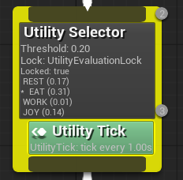

# BTUtility Plugin

**BTUtility** is a lightweight and modular Utility AI framework fully integrated into the **Unreal Engine Behavior Tree** system. It allows developers to create dynamic, emergent AI behaviors by replacing traditional binary selectors with score-based decision-making.

> [!TIP]
> **See it in action:** Check out the [BTUtility Sample Project](https://github.com/ric-fm/BTUtilitySample) for a basic implementation and usage examples of the framework.


> [!WARNING]
> **Project Status:** This plugin is currently in a **very early research and experimental state**. It was developed as a "for fun" project to explore Utility AI architectures within the Unreal Behavior Tree system. It has not been extensively tested for production environments. Use at your own risk and expect potential API changes.

---

## Overview

Traditional Behavior Trees rely on conditional logic to pick the first "valid" branch. **Utility AI** shifts this paradigm by evaluating multiple "Considerations" to calculate a score for each potential action to select the best one at any given time. This allows for complex behavioral trade-offs: an NPC might prioritize "Gather Resources" based on inventory space and tool durability, but will dynamically switch to "Find Shelter" if a combination of approaching nightfall and dropping temperature yields a higher utility score.

### Key Components

* **Utility Selector Composite:** A custom composite node. It functions similarly to a native Selector but determines the execution order of its children based on their calculated utility scores.
    * **Utility Tick Service:** A specialized service that enables continuous re-evaluation of the tree, allowing the AI to switch behaviors immediately if a higher-priority utility is detected.


*Utility Selector with an active Utility Tick and threshold/lock configuration.*

* **Utility Decorator:** The bridge between considerations and the tree. It calculates the score of the branch by evaluating a set of considerations.
    * **Utility Considerations:** Modular logic units that return a normalized score (0.0 to 1.0).
    * **Response Curves:** Mathematical functions used to map raw input data into meaningful utility values.

    
*A Utility Decorator evaluating multiple considerations (Stat & Distance) using both Custom and Polynomial response curves.*

* **Lock Utility Service:** A service/decorator used to prevent re-evaluation, "locking" the agent into its current behavior until a specific task is completed. It is particularly useful to ensure the agent finishes latent actions, such as an attack animation.


*Using the Lock Utility service to prevent re-evaluation while a 'Mining' animation is playing.*

* **Utility Evaluator Decorator:** A decorator that gates branch execution based on a minimum utility score threshold. It can be used outside of a UtilitySelector.


*Advanced Usage: The Utility Evaluator acting as a conditional gate, using score thresholds to manage branch execution and abort logic.*

---

## Features

### Modular & Extensible Design
Decoupled logic architecture that prioritizes reusability across different agents and trees.

* **C++ Extensibility:** Inherit from `UBTUUtilityConsideration` and override `GetInputValue` to create data-driven logic units. The base class handles normalization and curve mapping automatically.

```cpp
UCLASS()
class UMyCustomConsideration : public UBTUUtilityConsideration {
    GENERATED_BODY()

protected:
    /**
     * Returns the raw input value (e.g., Distance, Health, Ammo).
     * This value is then processed by the Response Curve and normalized to 0.0 - 1.0.
     */
    virtual float GetInputValue(const FBTUUtilityContext& Context) const override {
        // Access Agent data through Context.Controller.
        return 1.0f; // Replace with custom logic
    }
};
```

* **Blueprint Extensibility:** Inherit from `UBTUUtilityConsideration_BlueprintBase` and override `GetInputValue`.

*Example of a custom consideration in Blueprint: Accessing the Controlled Pawn and its Stats Component through the Utility Context.*


### Advanced Response Curves
Transform raw input data into meaningful utility scores via mathematical mapping, allowing for fine-tuned NPC "personalities".

* **Mathematical Presets:** Built-in support for Constant, Binary, Linear, Polynomial, Logistic, Logit, Normal and Sine curves.


*In-editor preview of a Logistic response curve with adjustable Slope, Exponent, and Shift parameters.*

* **Native Unreal Curves:** Integration with RuntimeFloatCurve, enabling you to draw bespoke curves directly in the Unreal Engine curve editor for maximum precision.


*Using the Custom curve mode to define complex AI behaviors via the internal curve editor or External Curve assets.*

### Visual Debugging
Real-time visualizers within the Behavior Tree editor to monitor utility scores and curve evaluations.

 * Visual preview for Response Curves.

 
 *Real-time preview of the selected response curve within the Utility Decorator details panel.*
 
 * Live Scoring of Utility Selector Candidates.

 
*Real-time Behavioral Debug: The Utility Selector displays dynamic scores for each branch, highlighting the active selection and current lock status.*

---

## Future Work

* **Utility Archetypes:** Expand the system to support multiple personalities (e.g., Aggressive vs. Cowardly) within a single Behavior Tree by allowing considerations and parameters to be defined externally.

* **Enhanced Decision Locking:** Expand the utility re-evaluation locking logic. At the moment we use a blackboard key.

* **Decision Hysteresis & Inertia:** Improve behavioral stability mechanism. At the moment we just use a static score threshold.

* **Enhanced Debugging Tools:** Expand DebuggingTools (Gameplay Debugger, Visual Logger, ...)

* **Utility Simulation Tool:** Create an in-editor previewer for designers to test utility scoring.

* **Built-in Consideration Library:** Implement a collection of ready-to-use considerations for common gameplay queries.

---

## References

* Project Resources
    * **Sample project:** [BTUtilitySample](https://github.com/ric-fm/BTUtilitySample)
    * **Demo Video:** [Utility AI Showcase - YouTube](https://www.youtube.com/watch?v=ZWR0MAHfQ_0)

* Utility AI Theory
    * **An Introduction to Utility Theory** [Game AI Pro, Chapter 09](https://www.gameaipro.com/GameAIPro/GameAIPro_Chapter09_An_Introduction_to_Utility_Theory.pdf)
    * **Improving AI Decision Modeling** [GDC Vault](https://gdcvault.com/play/1012410/Improving-AI-Decision-Modeling-Through)
    * **Building a Better Centaur AI** [GDC Vault](https://gdcvault.com/play/1021848/Building-a-Better-Centaur-AI)

* Related Tools
    *  **Curvature** [Github](https://github.com/apoch/curvature)
